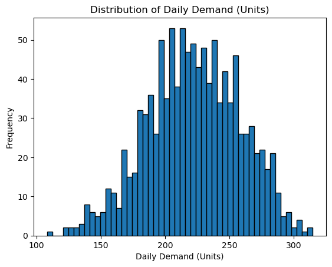
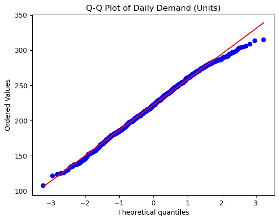
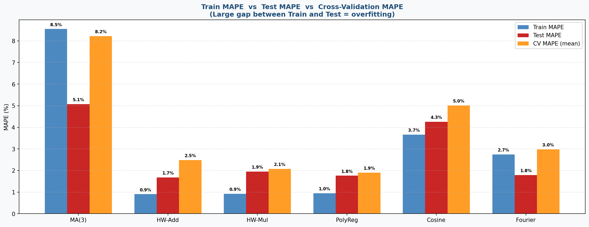
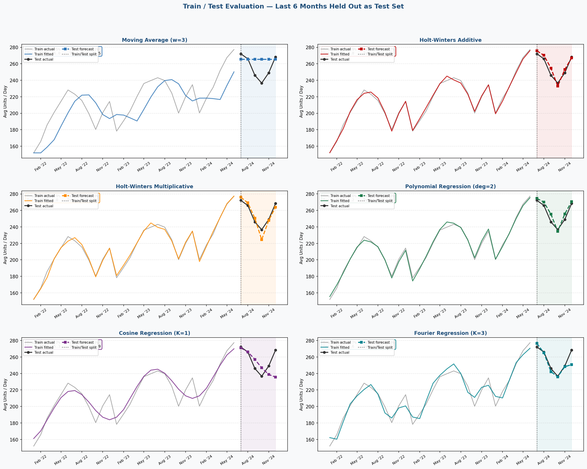
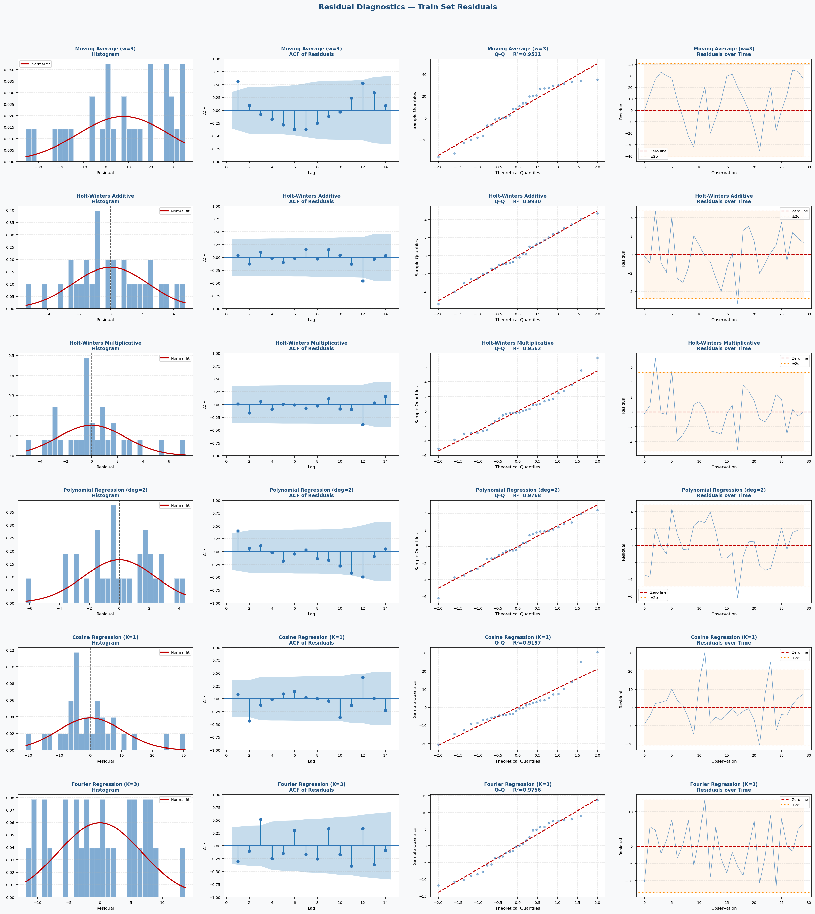

# From Forecast to Floor
### End-to-End Supply Chain Analytics — Demand Forecasting · Inventory Optimization · Cost Risk Simulation


---

## Overview

Integrated supply chain analytics framework built on **3 years of daily demand data (2022–2024)** for a single SKU. Links demand uncertainty through to inventory decisions, labor allocation, and cost risk — each step feeds the next.

---

## Project Structure

```
├── images/
│   ├── Data/
│   │   ├── Histogram.png
│   │   ├── QQ-plot.png
│   │   ├── Time-Series plot.png
│   │   ├── Time-Series plot 2.png
│   │   └── Time-Series plot 3.png
│   ├── model_comparison.png
│   ├── residual_diagnostics.png
│   └── train_test_evaluation.png
├── Data Analysis.ipynb
├── Forecast Models.ipynb
├── forecast.ipynb
├── supply_chain_data.xlsx
└── requirements.txt
```

---

## Analytical Pipeline

```
Raw Data → EDA & Distribution → Transformation → Seasonality Check
    → 6 Models Fitted → Train/Test Evaluation → HW-Additive Selected
        → Full-Data Forecast → Monte Carlo Parameters
```

---

## Dataset

| | |
|---|---|
| **SKU** | SKU-001 — General Merchandise Unit |
| **Period** | Jan 2022 — Dec 2024 |
| **Observations** | 1,096 daily · 36 monthly |
| **Trend** | Growing — ~180 → 200 → 225 avg units/day |
| **Seasonality** | Yearly — Q4 peaks (~+15%), Q1 troughs (~−12%) |

---

## 1. Time Series Exploration · `Data Analysis.ipynb`


---

## 2. Distribution Analysis · `Data Analysis.ipynb`

Raw demand is **not normally distributed** (Shapiro-Wilk p = 0.0065). Four transformations tested — **Yeo-Johnson** selected (p = 0.0847).





| Transformation | Shapiro-Wilk p | Selected |
|---|---|---|
| Raw Demand | 0.0065 | ❌ |
| Square Root | 0.0182 | ❌ |
| Log | 0.0341 | ❌ |
| **Yeo-Johnson** | **0.0847** | **✅** |

> Forecasting models use **original** demand values. Yeo-Johnson validates that residuals are approximately normal — justifying `Normal(μ, σ)` in Monte Carlo simulation.

---

## 3. Forecasting Models · `Forecast Models.ipynb`

Six deterministic models fitted on monthly aggregated data. **Last 6 months held out as test set.**

### Model Evaluation



| Model | Train MAPE | Test MAPE | CV MAPE |
|---|---|---|---|
| Moving Average (w=3) | 8.5% | 5.1% | 8.2% |
| **Holt-Winters Additive ✓** | **0.9%** | **1.7%** | **2.5%** |
| Holt-Winters Multiplicative | 0.9% | 1.9% | 2.1% |
| Polynomial Regression | 1.0% | 1.8% | 1.9% |
| Cosine Regression (K=1) | 3.7% | 4.3% | 5.0% |
| Fourier Regression (K=3) | 2.7% | 1.8% | 3.0% |

**HW-Additive selected** — lowest test MAPE (1.7%), no overfitting, purpose-built for trend + seasonal data.

### Train / Test Evaluation



### Residual Diagnostics



---

## 4. Forecast & Monte Carlo Parameters · `forecast.ipynb`

Model refitted on all 36 months. Residual std dev used as σ for simulation.

| | |
|---|---|
| **Forecast (Jan 2025)** | 241.02 units/day |
| **Std Dev (σ)** | 6.77 units/day |
| **95% Prediction Interval** | [227.75, 254.29] |
| **Monte Carlo input** | `np.random.normal(241.02, 6.77, size=(10_000, 31))` |

---

## 5. Inventory Optimization · `supply_chain_data.xlsx`

Live Excel formulas in the **Parameters & Assumptions** sheet.

| | Formula | Result |
|---|---|---|
| EOQ | `= SQRT(2 × D × S / H)` | ~2,121 units |
| Safety Stock | `= Z × σ_daily × √L` | ~108 units (95% SL) |
| Reorder Point | `= d̄ × L + SS` | ~1,756 units |
| Annual Inventory Cost | Ordering + Holding | ~$10,606 |

Parameters: D = 75,000 units/yr · S = $150/order · H = $5/unit/yr · L = 9 days · Z = 1.645

---

## 6. Workforce Allocation · `supply_chain_data.xlsx` (Excel Solver)

Linear programming via Excel Solver — minimizes daily labor cost subject to capacity constraints.

| Parameter | Value |
|---|---|
| Productivity | 12 units / labor-hour |
| Regular rate | $18 / hr (max 8 hrs/worker/day) |
| Overtime rate | $27 / hr (max 3 hrs/worker/day) |
| Worker range | 3 – 20 workers per shift |
| Demand constraint | Output ≥ forecasted daily demand |

---

## Tools

**Python** — `pandas` · `numpy` · `matplotlib` · `scipy` · `statsmodels` · `scikit-learn`

**Excel** — Data sheets · Parameters & Assumptions · EOQ / ROP formulas · Solver (LP)

---

## How to Run

```bash
pip install -r requirements.txt
jupyter notebook "Data Analysis.ipynb"
jupyter notebook "Forecast Models.ipynb"
jupyter notebook forecast.ipynb
```

Then open `supply_chain_data.xlsx` for inventory calculations and Solver optimization.

---

*Supply Chain Analytics Project — From Forecast to Floor*